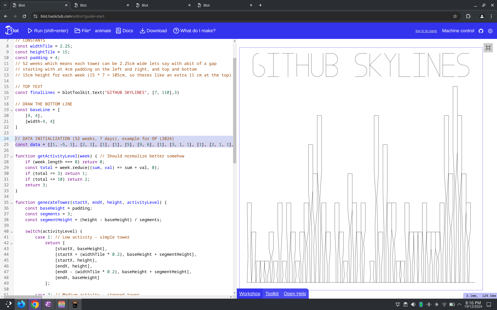

# Blot Skylines Project
Takes your github contribution for this year and draws your skyline.

## How do

1. add your classic access token to .env file, or a token with the required scopes (repo and read:user).
``` dotenv
GITHUB_TOKEN=your_personal_access_token_here
```

2. make sure you have the python packages installed

``` shell
pip install -r requirements.txt
```

3. run the script and input your username.

``` shell
python skyline.py
```

4. Copy the output into the blot file

``` javascript
// DATA INITIALIZATION (52 weeks, 7 days), example for wylited (2024)
const data = [[1, -5, 1], [2, 1], [1], [1], [5], [9, 6], [1], [3, 1, 1], [1], [2, 1, 1], [2, 2], [1], [5, 1], [8, 2, 1], [4, 3, 2, 1, 1], [13, 8, 8, 4], [12, 3, 2, 1, 1, 1], [3, 2, 1], [6, 1], [], [2, 1, 1], [6, 1], [2], [5, 4, 1, 1], [5, 3, 2], [1, 1], [6, 3, 2], [], [1], [5, 4, 3, 2, 1, 1], [2, 2], [2, 1, 1, 1, 1], [2, 2, 1], [6, 3, 2], [1], [1], [3, 2, 1], [5, 3], [2, 1], [1, 1], [4, 1, 1], [2, 2], [3, 2], [16, 1], [4, 3, 1], [7, 5, 4, 2, 2, 1], [43, 5, 4, 1], [16, 7, 5, 3, 3, 3, 2], [10, 5, 4, 3, 2, 1], [3, 2, 2, 1], [11, 2, 1], []]
```

5. Run the program at [blot](https://blot.hackclub.com/editor) and view your skyline!


